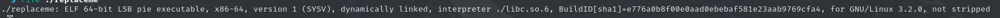
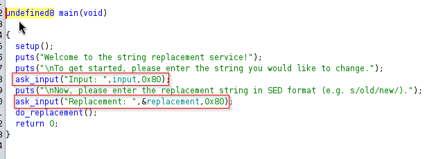
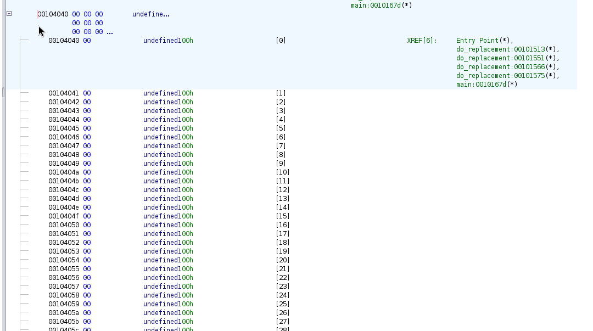
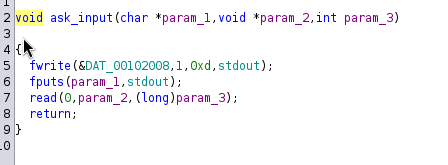
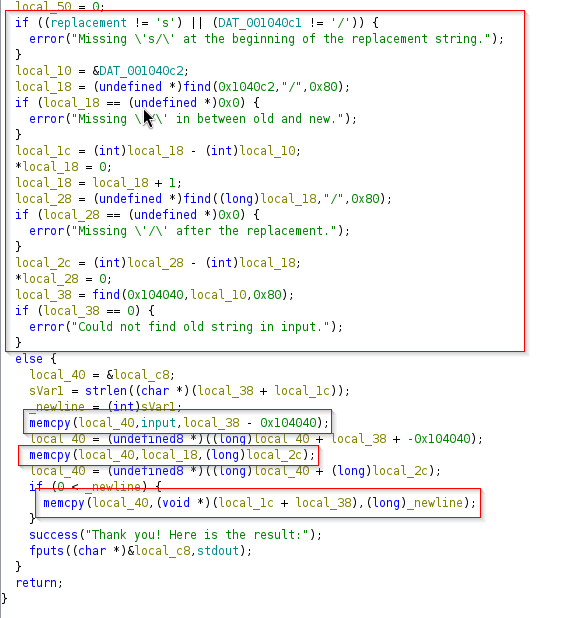
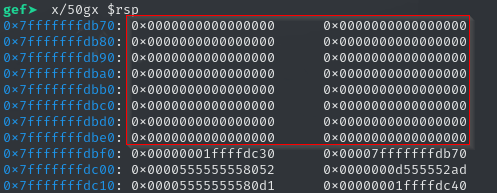
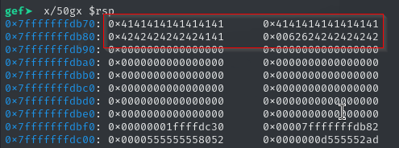
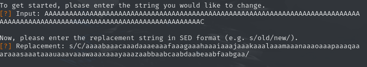
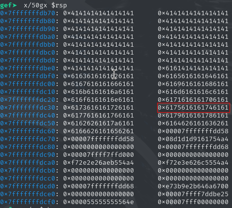

# Description

This challenge provided a linux SED like utility to replace either characters or texts. 

# Initial Steps

The first step is to determine what kind of binary and security the binary has been compiled with.


#### Binary Security


#### Security


So we have determined that the binary was compiled with a significant amount of security except it was not compiled with a stack canary. This immediately makes me want to approach the exploit by overflowing the return address on the stack. 

With that we also notice that the binary is compiled with Position Independent Executable (PIE) or also know as Position Independent Code (PIC). It also has Full RELRO, meaning no overwriting of the Global Offset Table (GOT).With the binary being compiled with PIE, we will have to in someway leak an address, we also will need to develop a ROP chain due to the no execute on the stack. 

Below is our inital plan of attack

1. Find a method to overwrite the return address
2. Leak a libc or binary address
3. Develop a ROP chain and redirect execution

Trust me, much easier said than done but lets get started. 


# Reverse Engineer 

Just before we get into Reverse Engineering the binary, lets take it for a spin and see what normal execution looks like. We can also use this time to run it a time or two with some odd inputs and see how it handles it. We may find a segfault on accident or break the program which would give us quite a bit of insight in how to attack it.

#### Main
After opening up the binary in Ghidra and navigating to the main function, we can see that the program is fairly simple.



I went ahead and highlighted some things that stood out to me on initial assessment. We see the program has some functions called ask_input() and do_replacement(). We can assume that ask_input() will do just as it says and take user input. We also see at the end a function I forgot to highlight called, do_replacement(). 

Before we dive into ask_input() lets double click on the input variable and see what it exactly is.



So if you double click on input in Ghidra it takes you to the .bss section of the binary. Not shown in the picture but this array, You can tell its an array for 1 byte values because on the left you see the memory addresses increase by 1 byte exactly. If this were integers or another type, it would increase by the respective size of the type. This array is of the size 128. so in C it would be like so char input[128]; Also since its in .bss section we can assume the array was created, but not initialized. Sometimes this means there may be junk values in the array. Something to keep in mind when working through a binary. The size also corresponds to the arguments provided to the ask_input function in main. We see the value 0x80 is passed which just so happens to be 128 to decimal form. So we can assume that the ask_input() function will be reading 128 bytes of char, and storing it in the array we see.

#### Ask_Input


The ask_input  function is pretty much exactly as we expected, it outputs some stuff then calls read() and stores what is read to param_2 or in this case variable input. param_3 is the amount to read. Its always good to look up the man page of C functions if you are unfamiliar or just simply forget what a C function does and what arguments it takes. Its a very helpful piece of information when analyzing binaries. 

Were going to move on to the next interesting function do_replacement(). We know that ask_input() is called twice, so we know that it will read input to another buffer which in the case of this binary is called replacement. 

#### Do_Replacement


Here is the bulk of the functionality in this binary, be mindful the image does not represent the full function, there are variables detected by ghidra above what is displayed in the image. 

First off, we notice in the first highlighted area with the redbox, a bunch of error catching statements. Which it seems to making sure the input provided aligns correctly with what the binary wants. 

The input has to be formatted as such:

s/C/TEXT/

If you are unfamiliar with SED functionality do a quick google search and it will make sense. 

Moving on past the else statement located near the middle we get to the interesting part. The first thing that jumps out at me is the function memcpy, this function is notorious for being used incorrectly and I took a look the binary and there is no malloc or calloc function. This means we are doing a memcpy on the stack which is perfect for us if we can abuse it. 

# Solution

Now that we have a general idea of what the binary is and how the memory is laid out, we can now develop the exploit. 

```!/usr/bin/python3

from pwn import *

LOCAL = False
binary_base = 0
e = ELF('./replaceme')
LIBC = ELF('/HTB/Challenges/Replaceme_PWN/libc.so.6')
if LOCAL:
        #p = process('./replaceme')
        p = gdb.debug('./replaceme','''
                break *main
                break *do_replacement
                break *do_replacement +  509
                break *do_replacement + 413
                break *do_replacement + 544''')
else:
        IP = str(sys.argv[1]) if len(sys.argv) >=2 else '0.0.0.0'
        PORT = str(sys.argv[2]) if len(sys.argv) >= 3 else '4444'
        p = remote(IP,PORT)
```

This script here is just the basic setup, importing pwntools and setting up our binary and LIBC environment so we can find offsets. For ease of understanding, I left my comments and or debugging portions in. This is not a clean exploit but I left it all in here so that not everyone thinks I did this the first try. 

#### Examine the stack

Lets run the program and break on the do_replacement function we identified earlier with the memcpy functions since that seemed pretty interesting.


So it asks us for a string we would like to change, then we specify what to replace with the SED like utility

The image above shows we want to replace "C" with "BBBBBBBBBBBBBBBBBBB". We will now break on the memcpy functions we found and see how it works on the stack.



Above we can see before the memcopy functions complete, we see that the stack has 128 bytes created. We can assume that our string will be placed here. Notice thatright after our array, we have a 4 byte value, then another 4 byte value of NULL.



Above we can now see the stack after both memcpy functions have completed. Take notice, we see 0x41 but we do not see any 0x42 or char "C". We also see that our replacement text is placed directly after the initial string. 

This makes me believe that if we enter 128 bytes of information for our initial string, then replace the last character of that string with other values, we can overwrite the data beneath the array and hopefully reach the return address. Lets go ahead and try to just overwrite the RA 

#### Overwriting the return address.

First lets print out 126 "A" then a "C" which will be replaced. You may ask thats only 127 bytes, dont forget the newline char that will be sent when we press enter \x0a. So it should look something like so:

`AAAAAAAAAAAAAAAAAAAAAAAAAAAAAAAAAAAAAAAAAAAAAAAAAAAAAAAAAAAAAAAAAAAAAAAAAAAAAAAAAAAAAAAAAAAAAAAAAAAAAAAAAAAAAAAAAAAAAAAAAAAAAAC`

then when prompted for the replacement string, lets generate a pwn cyclic string so we can find out where we overwrite the return address.

Do that simply with 

`pwn cyclic 123`
`aaaabaaacaaadaaaeaaafaaagaaahaaaiaaajaaakaaalaaamaaanaaaoaaapaaaqaaaraaasaaataaauaaavaaawaaaxaaayaaazaabbaabcaabdaabeaabfaa`

Lets send it now and check the stack again.



Again we place our break on do_replacement and lets check out the stack after the memcpy functions complete.



We definately overwrote the return address here. The return address is highlighted in red. 


#### Next Steps

Recall our goals from earlier:

1. Find a method to overwrite the return address
2. Leak a libc or binary address
3. Develop a ROP ch

Now we need to find a Libc or binary address so we can determine the base address to work around PIE and ASLR.

One interesting tidbit to remember here, is the program outputs the final string result. So theoretically, in our stack above it should print out the entire stack up to the first \x00 or NULL value. So we can abuse that to leak an address. Lets work through that by first checking the stack under normal conditions and identify some addresses that we could possibly leak.
